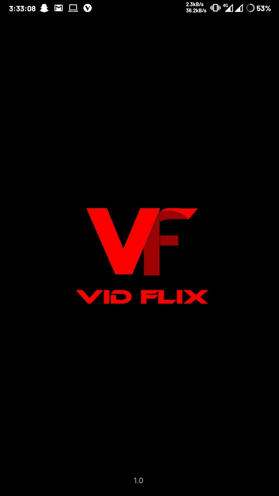
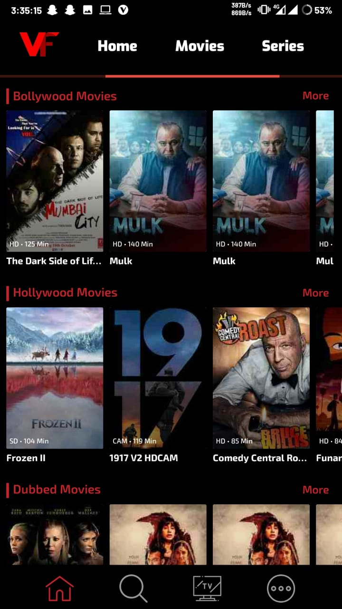
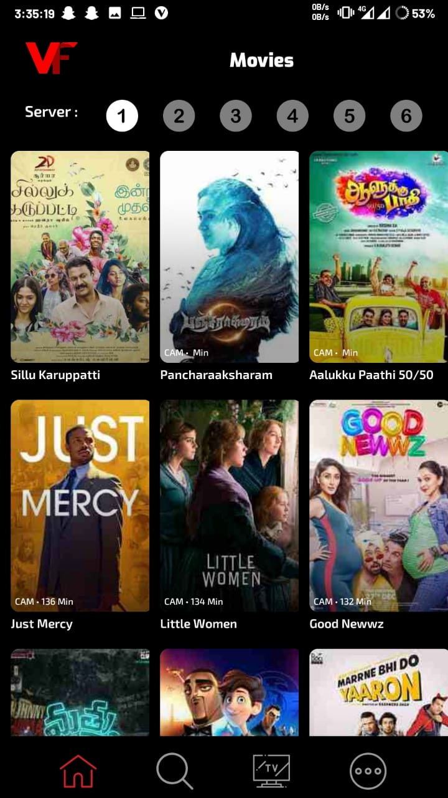
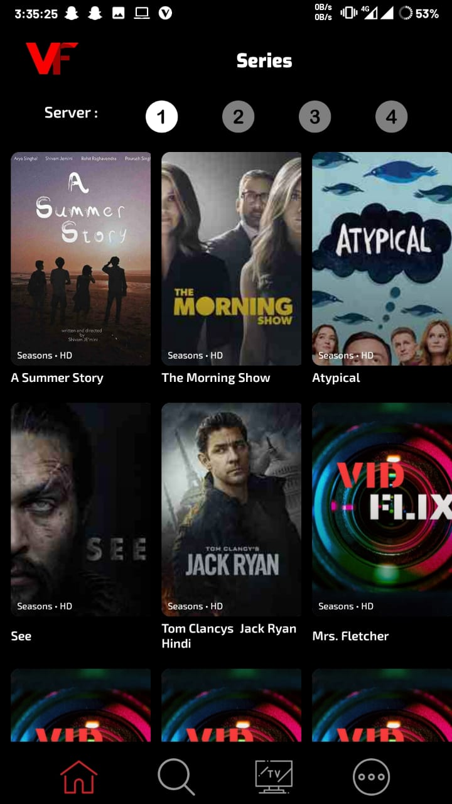
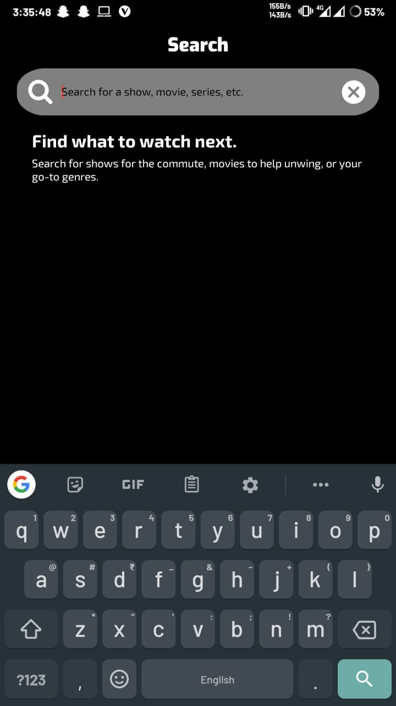
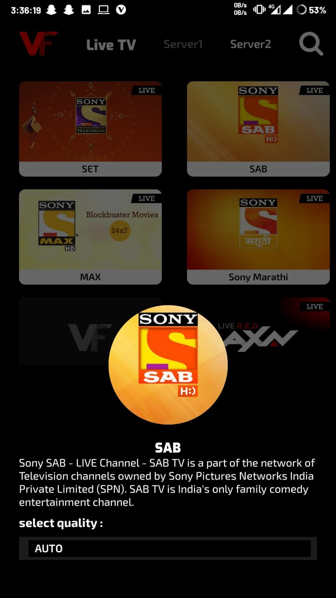
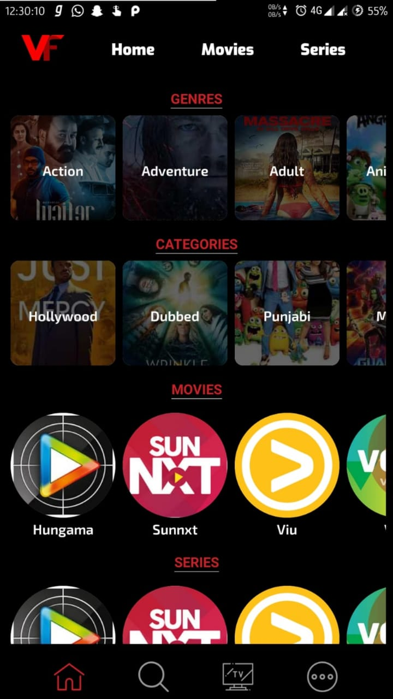
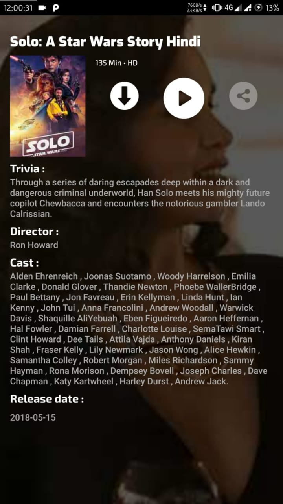

> .
> This Project has been Deprecated and servers no longer maintained
> .

⚠️   Due to few reasons, the latest source code of this is not available here publicly.

# openHub
A non-profitable idea to help people

A Large open source platform which provides you all the content to satisfy your entertainment needs.

Find all the releases from [here](https://github.com/NitishGadangi/vidflix.net-app/releases).

## ScreenShots
<table>
    <tr>
     <td><kbd></kbd></td>
     <td><kbd></kbd></td>
     <td><kbd></kbd></td>
     <td><kbd></kbd></td>
     <tr> 
      <td><kbd></kbd></td>
      <td><kbd></td>
      <td><kbd></kbd></td>
      <td><kbd></kbd></td>
    </tr>
</table>


```the app is in final beta state```<br>
``` *ALL SPECIFICATIONS AND DESCRIPTION WILL BE UPDATED SOON* ``` <br>
###### All the previous commits won't be visible as there are under my private repo.
###### Also the credentials to APIs are kept hidden.
**Made with ❤️ by [Nitish](https://nitishgadangi.github.io/) <br>**
**Designed and Developed by [Mr. Black Turban]()**
